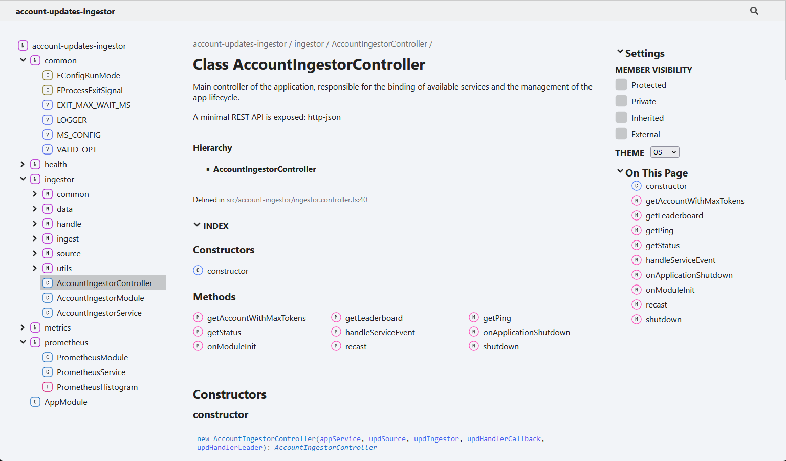
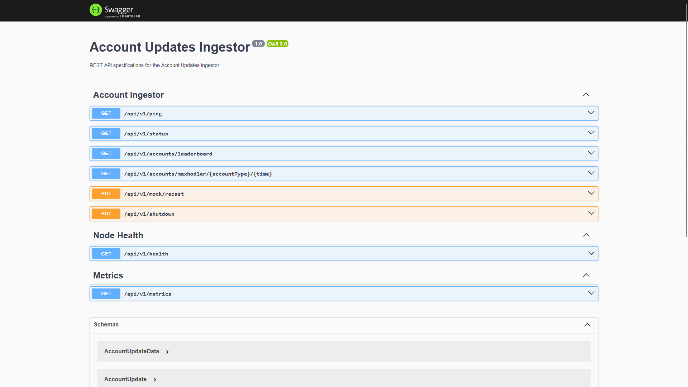
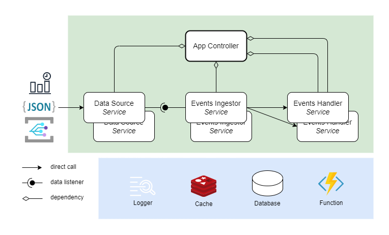
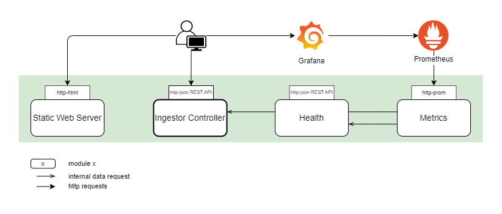
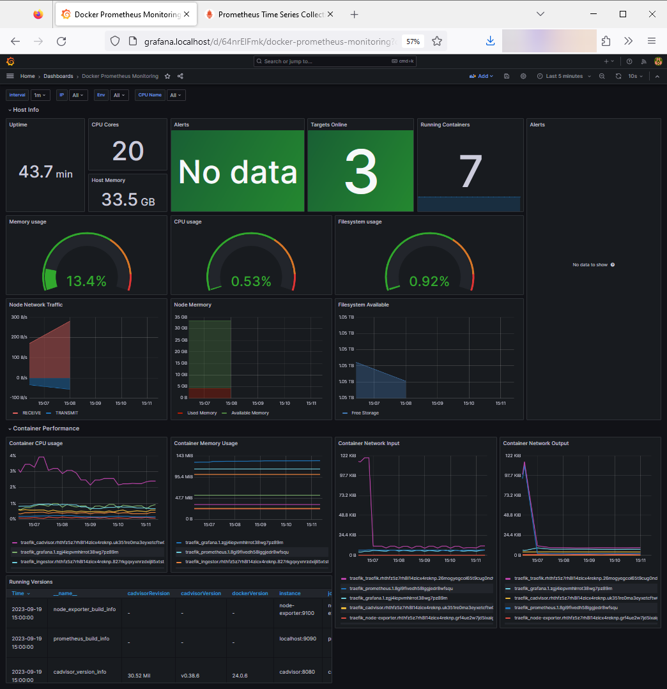
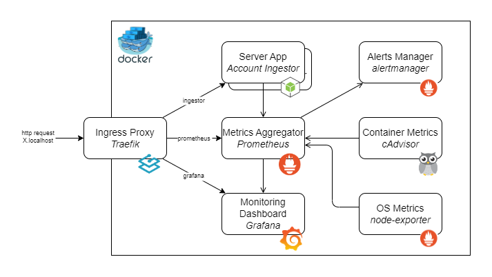
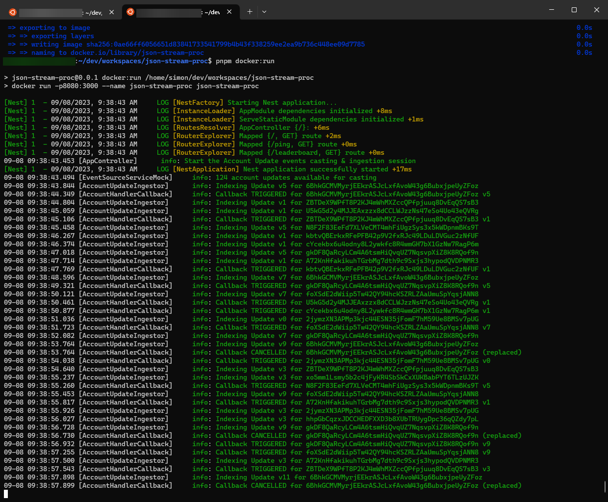
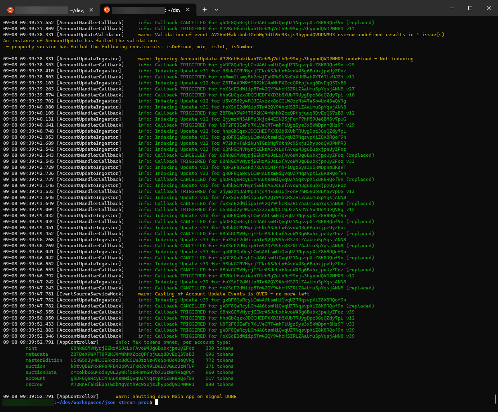

# Ingestion and Handling of on-chain Account Update events

## Description

Purpose: Simulation of the casting, ingestion & handling of accounts' update events issued by a blockchain logging events.

Solana account updates are considered, being streamed continuously in a real time system. In the context of this project, the casting of logged account updates is emulated: a static JSON file is loaded (made of +100 entries) and their casting is made sequentially, based on random time intervals.

This project demonstrates possible techniques for ingesting data & handling their further processing. Moreover it emphasizes on good software development practices, in terms of tooling, architecture and functionnal design to implement a production-ready app server.


## Tech requirements

The [pnpm](https://pnpm.io/) package manager for Node.js is used & recommended, however it can be replaced by [yarn](https://yarnpkg.com/). You can even stick to [npm](https://), just use `npm run X` instead of `pnpm X` in the below commands.

You can install `pnpm` with the command:
```bash
# Package installation
$ npm install --global pnpm

# OS integration (optional)
$ pnpm setup
```

This project has been developped using the [Node.js](https://nodejs.org) LTS version `18.17`.

Commit hooks are implemented using [husky](https://typicode.github.io/husky/). They lint, format & test the code automatically prior to actually committing.

The [Docker](https://docker.io) platform can be optionally used to ease the local deployment of containers.

## Instructions

### Quick run

Having `pnpm` (or `yarn`) installed:
```bash
# Install and run locally (dev mode)
$ pnpm i && pnpm start
```

If you just want a quick shot without installing `pnpm` or `yarn`:
```bash
# Install and run locally (dev mode)
$ npm i && npm run start
```

Even cleaner, if you have Docker locally installed and want the artifacts & dependencies to be in the Docker image only:
```bash
# Install and run locally
$ npm run docker:build && npm run docker:run

# Install and run locally (production mode)
$ npm run docker:build:prod && npm run docker:run:prod
```

In those modes, check out the console output and eventually have a look at [localhost:3000](http://localhost:3000).

If you want a view on the monitoring system, refer to the Docker Swarm [section](#docker-swarm-deployment) for instructions.

### Installation

Download all necessary package dependencies, including development ones:
```bash
$ pnpm install
```

### Running the app

For local runs of the app, in dev or production-like mode:
```bash
# development
$ pnpm start

# watch mode
$ pnpm start:dev

# production mode
$ pnpm start:prod
```

### Test

```bash
# unit tests
$ pnpm test

# e2e tests
$ pnpm test:e2e

# test coverage
$ pnpm test:cov

# End-to-end tests
$ pnpm test:e2e
```

### Docker Integration

[Docker](https://docker.com) is used here for releasing a production-ready app.
Actual Docker configs are not designed for supporting an isolated development framework.

You need a local [Docker](https://docker.com) installation to run the followings:

```bash
# Build the production-ready app container:
$ pnpm docker:build

# Build the production-ready & optimized (webpack) app container:
$ pnpm docker:build:prod

# Run locally the container
$ pnpm docker:run

# Access to the container shell
$ pnpm docker:sh

# Remove the generated docker container(s) and image(s)
$ pnpm docker:cleanup
```

Review the script for building the production image: refer to [Dockerfile](./Dockerfile) and [Dockerfile.prod](./Dockerfile.prod) along with [webpack.prod.js](./webpack.prod.js).

The main benefit is to run the server app without a development context, i.e. without the node modules' dev dependencies.

### Webpack Optimization

Webpack is used to further optimize the generated app, by bundling all the code into a single `dist/server.js` file and having it minimized. Code mapping are kept to support debugging operations.

The webpack-based bundling is intended for the release of a production package. The integration of the Hot Module Replacement (HMR) for developing in this mode has not been considered/implemented.

Refer to the production config file [`webpack.prod.js`](./webpack.prod.js).

```bash
# Compile & bundle the app using Webpack
$ pnpm webpack:build

# Run locally the Webpack bundle
$ pnpm webpack:run
```

### Clean up

Quickly reset your local repository, by removing all temporary artifacts:
```bash
# Remove all downloaded & generated artifacts
$ pnpm reset
```

Clean up your local Docker image & container registry:
```bash
# Remove the last generated Docker containers & images
$ pnpm docker:cleanup
```


## Documentation

### TS Code Documentation

The application's complete TypeSript Code documentation can be generated on demand:
```bash
# Generate a Typedoc documentation
$ pnpm doc
```

This solution is based on [Typedoc](https://typedoc.org/).

The generated Web doc is then available in the sub-directory `./docs`.

Screenshot of the generated TS Doc:



### OpenAPI Documentation

OpenAPI OAS 3.0 specifications of the app controllers' exposed REST APIs are made available.

This documentation solution is based on [@nestjs/swagger](https://www.npmjs.com/package/@nestjs/swagger).

The publication of the OpenAPI specifications can be enabled or disabled based on the config parameter `MS_CONFIG.OPENAPI_PUBLISH` set in [common/config](./src/common/config.ts).

The Swagger Web doc is available at the URI [/api](http://localhost:3000/api)

The Swagger JSON is available at the URI [/api-json](http://localhost:3000/api-json)

Screenshot of the generated Swagger Doc:




## Server App Architecture

### Key drivers

While this is a demo application, the design of this app meets the following fundamentals:
  * The service must be **evolutive**: modularity (add/remove/replace internal services without impacting others); strict minimal dependencies among components; communications through internal generic interfaces or events
  * The service must be **scalable**: support for vertical & horizontal scaling; low CPU & memory footprint; high throuput & low response time; extensive usage of async supports and concurrency considerations
  * The service must be **secure**: low network exposure; systematic external inputs validation; lowest trust even among internal services; clean errors management, based on exceptions propagation

Actual system has been divided into 3 main service area (and corresponding service types):
1. Handling the external source of data events
2. Ingestion of the information, account updates here (logged onchain events), for their indexing, validation/filtering, transformation, persistence management, etc and moreover enabling their further processing by specifc handlers
3. Handling specific processing of ingested events: triggering further handling per the event type, tracking and managing statistics, etc

### Modules & Services



One main application module has been considered on top of 3 main types of services:

1. **Application Controller**: Responsible for the application lifecycle and managing the main services composition and runtime.
    * Init, start, stop & graceful shutdown management
    * Binding the services together by registering services or callbacks among each other
    * Exposing a REST API for reporting the application status and service info to remote clients

    Application Controller implementation: [ingestor.controller.ts](./src/account-ingestor/ingestor.controller.ts)

2. Service **Data Source Handler**: An adaptor responsible for monitoring (pulling/listening) an external source of events, validating these inputs and reporting them internally for their ingestion by the system.
    
    It can consist in a client listening to a message queuing system, or polling a DB or API (REST http / RPC).

    Service interface: [IEventSourceService](./src/account-ingestor/event-source/IEventSourceService.ts)

    The implemented event casting emulator fetch (http GET) a JSON file, transform and validate the account update events using a Code-as-Schema approach where the fields & values are constrained. Then the entries are scheduled to be sequentially cast through an event emitter channel, to which events listener services can subscribe their callback method to further process the data.

    For the events sourcing emulator, refer to [EventSourceServiceMock](./src/account-ingestor/event-source/EventSourceServiceMock.ts)

3. Service **Events Ingestor**: A service registering its event-specific callback(s) to a data source handler to ingest imported account update data.

    Actual implementation has a handler specific to events of type 'account updates', emitted by the data source handler, in order to ingest them.

    Events data are validated, ignored if considered as invalid (missing or unknown field or value) and then indexed in memory, while a remote persistent storage might be considered. Once an account update is ingested, the registered handlers for account updates have their dedicated callback triggered.

    Service interface: [IEventIngestorService](./src/account-ingestor/event-ingestor/IEventIngestorService.ts)

    Account Update Ingestor implementation: refer to [AccountUpdateIngestor](./src/account-ingestor/event-ingestor/AccountUpdateIngestor.ts)

4. Service **Events Handler**: Services responsible for performing specific handling of ingested account updates, per their type & info.

    The update handler services are registered to a given events ingestor service in order for their async processing to be triggered on the ingestion of new events.

    2 implementations of this service type are available:
    * one dedicated to triggering callbacks, which expiration time is expressed by the Account Update events
    * another is dedicated to maintaining a minimum leaderboard/tracking of the accounts owning the most tokens, grouped per account types

    Service interface: [IEventHandlerService](./src/account-ingestor/event-handler/IEventHandlerService.ts)
    
    Account Update Handler for Callbacks: [AccountHandlerCallback](./src/account-ingestor/event-handler/AccountHandlerCallback.ts)
        
    Account Update Handler for tracking accounts' max tokens holding: [AccountHandlerTokenLeaders](./src/account-ingestor/event-handler/AccountHandlerTokenLeaders.ts)


### Design patterns

The general adopted pattern is a controller-services approach for this simple app.

The project structure allows setting clear boundaries among each components scope and dependencies. Moreover extracting the actual 4 services into separate and autonomous full modules (having their own controller, exposed RPC API, etc) is made easily possible.

#### Service binding

To lower down the dependency among services, they don't communicate directly to each other. Instead the listeners callback are registered to the triggerer. This binding of services (handler's callback registration) is performed by the app controller. 2 mains types have been implemented:
* EventEmitter-based technique for Ingestors to register their callback to be triggered on a given event name
* Interface method direct registration for Events handlers callback to be triggered by Ingestor services compatible with the event type (payload)

Refer to the operated binding of services in [AppController.bindServices()](./src/account-ingestor/ingestor.controller.ts).

#### Delaying

In order to schedule/delay an async action (e.g. casting next account update event) or to wait for a given state (e.g. wait for all callbacks to be triggered before shutting down) a Node-based Timeout technique is used.

#### Validating

A Code-as-Schema approach has been opted to validate and filter out problematic account update events. The implemented technique is based on [class-validator](https://www.npmjs.com/package/class-validator). 

Fields and values are checked per the constrains on fields & values, as implemented for example in [account-update.dto.ts](./src/account-ingestor/data/account-update.dto.ts).

#### Graceful App Shutdown

All interruption signals of the app runtime is caught and a graceful shutdown implemented.

First, listening to the events source is closed, then the app will wait for all account updates' related callbacks to be triggered. A maximum wait time is configurable from the setting `EXIT_MAX_WAIT_MS` in [common/config.ts](./src/common/config.ts).

### Technical considerations

The [Node.js](https://nodejs.org) runtime framework is used for handling a minimal server application.

The [Nest.js](https://nestjs.com) development framework is used for benefiting from its modularity and the reuse of bullet-proof design patterns, reusable components and low footprint in terms of performance impact. 

The underlying [Express.js](https://expressjs.com) platform has been opted, and a minimal REST API has been initiated at the application controller level. Refer to the minimal [landing page](http://localhost:3000) when the app is locally running.

The TypeScript programming language is used for its type safety and general improvements over JavaScript.

The testing framework is made of the [Jest.js](https://jestjs.io) & [Chai](https://www.chaijs.com/) solutions.

### Production Considerations

The integrated Logging technique is based on the flexible [Winston Logger](https://www.npmjs.com/package/winston). 

In production mode (`NODE_ENV=production`) the console output is disabled and logs are aggregated in a JSON file, with the provided log level thresholds. The later enables a log watcher service such as Kibana or CloudWatcher to integrate these logs and define filters and alerts for a continuous monitoring.

A file rollout mechanism based on time (daily), the file size or content length is implemented. Refer to [`logger.ts`](./src/common/logger.ts).

As long as there is no external data persistency, current implementation stores all data in memory. This is problematic for the current account update events' ingestion service since it keeps in memory an entry for every met account. This is not scalable on a real system. Other services have limited states storage in memory, those are temporary (callback handler service) and/or limited (tokens leaderboard).

Actual implementation can automatically shut down once all account update events are processed. On an actual system, a ping & status REST API should be used to check for the service availability. Else the Docker container's resources usage (CPU, memory, network usage) would have to be monitored and a scaling service such as K8s or Fargate-like, Docker Swarm is to be considered, as well as KV-based caching and event-based coordination systems among the app instances.

The interesting challenge for going to production is to replace actual mock implementation to cast events by an actual external data source integration: a continuous polling or event-driven (Websocket, Event/Message Queuing), then the integration will be fun and performance considerations further challenged.

Such external services would also have to be continuously monitored (external data source server, in memory caching & database): their access, availability, performance and operating costs. Actual implementation has initiated such an advanced metrics support, based on Prometheus.


## Monitoring

An overview of the modules composing the app server, their exposed APIs and the main tools used for monitoing the app health via metrics:



Default app server API URLs are 
* `http://localhost:3000/api/v1/metrics` for the Prometheus metrics (Prom format)

* `http://localhost:3000/api/v1/health` for the Nodejs healthcheck, based on Nodejs-Terminus (JSON)

### Stack

You can use Docker Compose to quickly launch the app server along with a [Prometheus](https://promotheus.io) & a [Grafana](https://grafana.com) nodes.

Run the Node.js app, Prometheus (+ node-exporter) and Grafana containers locally:
```bash
# Deploy and run the containers using docker compose
docker compose up -f deploy/docker/docker-compose.yml

# Deploy and run using docker compose based on the npm script
pnpm docker:compose:up
```

Alternatively, use the npm script that comes with default cleanup options:
```bash
# Stop the containers using docker compose
npm run docker:compose:up -f deploy/docker/docker-compose.yml

# Stop the containers using docker compose based on the npm script
pnpm docker:compose:down
```

### Prometheus

An open-source monitoring system with a dimensional data model, flexible query language, efficient time series database and modern alerting approach.

Refer to the product Web site: [promotheus.io](https://promotheus.io)

The Prometheus main configuration is available in [promotheus.yml](./monitor/prometheus/prometheus.yml)

The Promotheus Web UI is available at [localhost:9090](http://localhost:9090), using Docker Compose, or [promotheus.localhost](http://promotheus.localhost) using Docker Swarm.

### Grafana

Grafana is the open source analytics & monitoring solution for every database.

Refer to the product Web site: [grafana.com](https://grafana.com)

Grafana main configurations:
* General [monitoring config](./monitor/grafana/config.monitoring)
* Provisioning [Data Sources](./monitor/grafana/provisioning/datasources/datasource.yml)
* Provisioning [Dashboards](./monitor/grafana/provisioning/dashboards/)

Grafana Web UI: [localhost:3000](http://localhost:3000) using Docker Compose, or [grafana.localhost](http://grafana.localhost) using Docker Swarm.

Default user is `admin`, see the environment [config](./monitor/grafana/config.monitoring) file.

Screenshot of the Grafana monitoring dashboard:




### Docker Swarm Deployment

A more advanced stack supported by [Docker Swarm](https://docs.docker.com/engine/swarm/) is provided.

Its purpose is to:
* Proxyfy the http accesses to the Docker containers
* Embed a complete monitoring stack
* Emulate locally an actual deployment in production



The ingress proxy is implemented using [Traefik Proxy](https://traefik.io/traefik/): a reverse proxy and load balancer.

In order to further feed our [Prometheus](https://promotheus.io) metrics, the following are integrated:
* Google [cAdvisor](https://github.com/google/cadvisor) (Container Advisor) to provide insights about the resource usage and performance characteristics of the running containers.
* Prometheus [node-exporter](https://github.com/prometheus/node_exporter) to monitor the host system

The [Grafana](https://grafana.com) supports the provided dashboard templates, and the latters can be further customized.

Also the Prometheus [Alertmanager](https://github.com/prometheus/alertmanager) is deployed. This enables sending alert messages, e.g. to a Slack channel.

Publicly exposed services:
* Account Update Ingestor API: [ingestor.localhost/api/v1/*](http://ingestor.localhost/api/v1/health)
* Grafana Web dashboard: [grafana.localhost](http://grafana.localhost)
* Prometheus Web UI: [prometheus.localhost](http://prometheus.localhost)

The Docker Swarm configuration is available in [docker-stack-monitor.yml](./docker-stack-monitor.yml).

Docker Swarm stack instructions:
```bash
# Docker CLI for deploying the stack / services
docker stack deploy -c deploy/docker/docker-stack-monitor.yml <stack_name>

# Deploy the services using the npm script
pnpm docker:stack:deploy

# Stopping & removing the services
docker stack rm <stack_name>

# Stopping & removing the services using the npm script
pnpm docker:stack:rm
```

## Technical Challenge

Below  are the provided inputs & expectations of the technical challenge this project has been originally developped for.

### Features support

- [x] Create classes having appropriate encapsulation, attributes, and well defined interfaces.

- [x] Account updates' data are read asynchronously from a json file (Vs. a live continuous data stream)

- [x] Each account comes into the system at a continuous uniform (random) distribution between 0 and 1000ms

- [x] Display a short message log message to console when each (accountId + version) tuple has been indexed.

  - [x] If an old version of the same account is ingested, ignore that update.

- [x] Display a callback log when an account’s `call_back_time_ms` has expired. 

  - [x] If the same account is ingested with a newer version number, and the old callback has not fired yet, cancel the older version’s active callback. 

  - [x] Display a message when an old callback is canceled in favor of a new one

- [x] Once all events and callbacks have completed, print the highest token-value accounts by AccountType (taking into account the right version), and gracefully shut-down the system.

### Info

#### Data model

Accounts' sample data set:

```json
[{
  "id": "GzbXUY1JQwRVUf3j3myg2NbDRwD5i4jD4HJpYhVNfiDm",
  "accountType": "escrow",
  "tokens": 500000,
  "callbackTimeMs": 400,
  "data": {
    "subtype_field1": true,
    "subtype_field2": 999
  },
  "version": 123
}]
```

Each account has the following information:

`id` - Unique identifier of the account

`accountType` - Type of the account.

`data` - Data of the account. All accounts that share the same AccountType have the same data schema. This is the information in which clients are most interested in. You can assume these schemas are fixed.

`tokens` - Amount of tokens in the account.

`version` - Version of the account on chain. If two updates for the same account come in, the old
version should be erased.

`callbackTimeMs` - Time at which we’d like to print the contents of the account to console after it’s
been ingested.

#### Example scenarios

These scenarios only cover a single accountID, but demonstrate the expected ingestion / callback behaviors:

##### Scenario 1 - Single Update

0ms - simulation starts - ID1 scheduled to be ingested 550ms (0-1000ms random) later

550ms - ID1 v1 is “ingested”, we print it as indexed

950ms - ID1 v1 callback fires (and we log with version 1)

##### Scenario 2 - Updates with Cancellation

0ms - simulation starts - ID1 scheduled to be ingested 550ms (0-1000ms random) later

550ms - ID1 v1 is “ingested”, we print it as indexed

650ms - ID1 v3 is “ingested”, print ID1 v3 indexed, cancel active ID1 v1 callback

~~950ms - ID1 callback fires (and we log with version 1)~~

1050ms - ID1 v3 callback fires

## Screenshots

Screenshots of the console output when running the app using `docker:run`





## License

Distributed under the [Apache License 2.0][license].

<!-- license -->
[license]: LICENSE